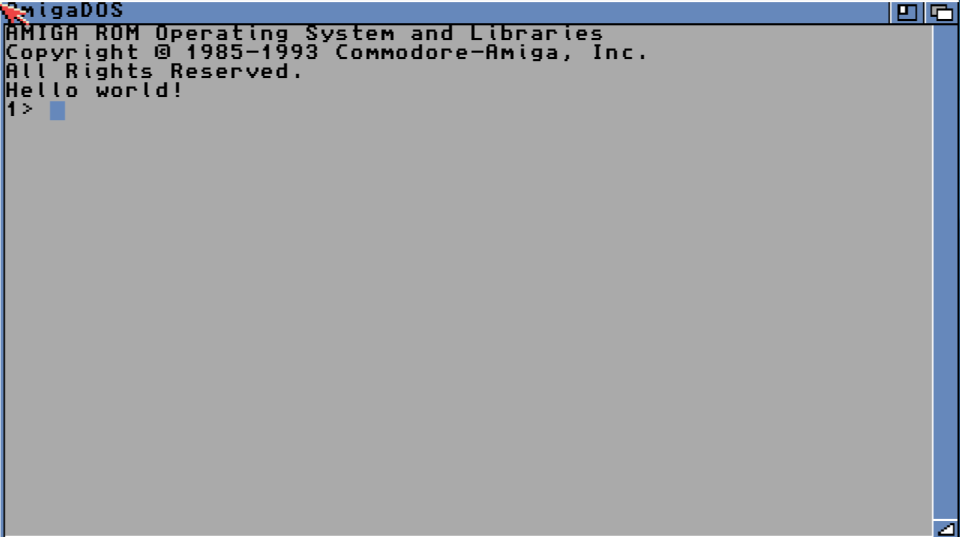

# Dockerfile for AmigaOS Cross-Compiler Toolchain

`Dockerfile` for [Stefan "Bebbo" Franke](https://github.com/bebbo)'s [amiga-gcc](https://github.com/bebbo/amiga-gcc) toolchain for Linux/AmigaOS cross-development.

A ready-to-use image built from this Dockerfile is available on [Docker Hub](https://hub.docker.com/r/sebastianbergmann/amiga-gcc/).

More information can be found [here](https://amiga.sebastian-bergmann.de/presentations/2017/evoke/amiga-software-development-in-2017).

## "Hello world!" Example

### AmigaOS C API

`hello.c` from [Radosław Kujawa](https://github.com/Sakura-IT/Amiga-programming-examples/tree/master/C/hello-world-amiga):

```c
#include <proto/exec.h>
#include <proto/dos.h>

int main(int argc, void *argv[])
{
    struct Library *SysBase;
    struct Library *DOSBase;

    SysBase = *((struct Library **)4UL);
    DOSBase = OpenLibrary("dos.library", 0);

    if (DOSBase) {
        Write(Output(), "Hello world!\n", 13);
        CloseLibrary(DOSBase);
    }

    return(0);
}
```


### Standard C Library

`hello.c` from [Radosław Kujawa](https://github.com/Sakura-IT/Amiga-programming-examples/tree/master/C/hello-world):

```c
#include <stdio.h>

int main()
{
    printf("Hello world!\n");

    return(0);
}
```


### Compilation

```
$ docker run -v $HOME:/host -it sebastianbergmann/amiga-gcc \
  m68k-amigaos-gcc /host/hello.c -o /host/hello -noixemul
```


### Execution

#### Docker-ized Emulation using FS-UAE

The `docker-execute-amiga` script used below can be downloaded from [here](https://raw.githubusercontent.com/sebastianbergmann/docker-execute-amiga/master/docker-execute-amiga.sh).

```
$ docker-execute-amiga helloworld
```




#### Docker-ized Emulation using Virtual AmigaOS (vamos)

```
$ docker run -v $HOME:/host sebastianbergmann/amitools:latest \
  vamos -C 68020 /host/hello
Hello world!
```

